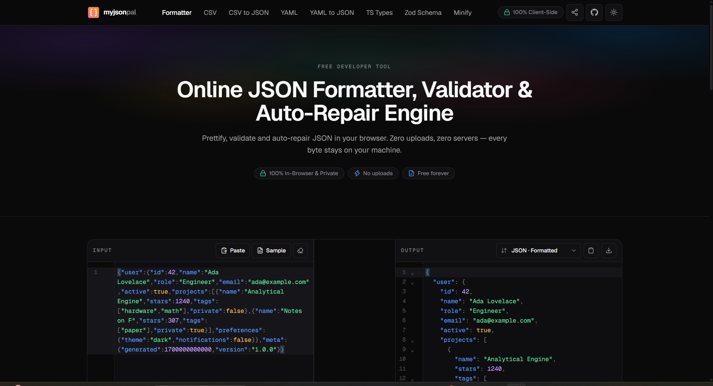
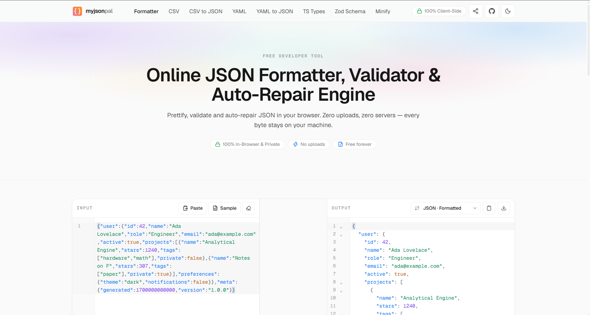
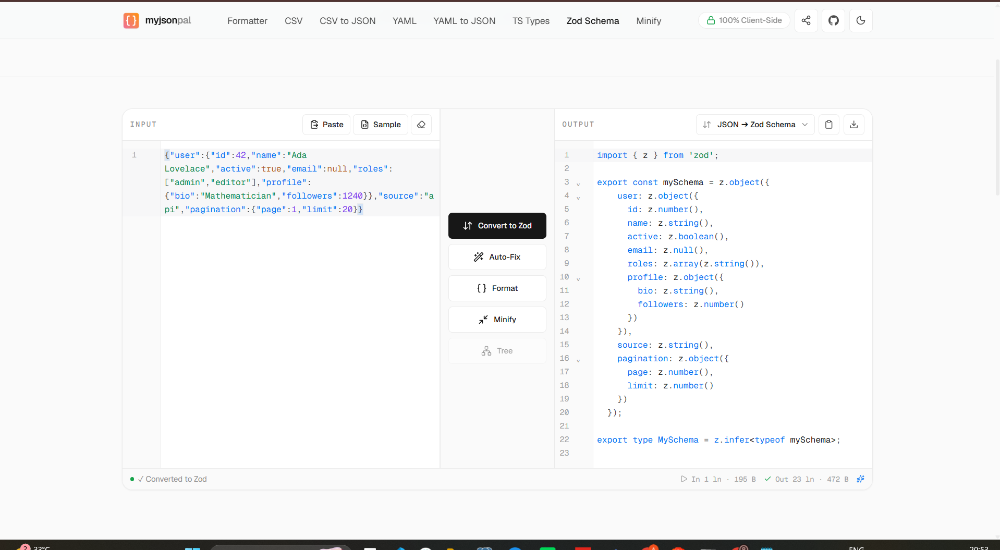
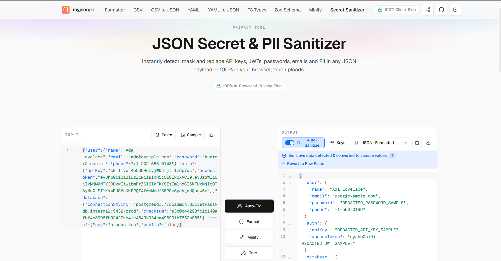
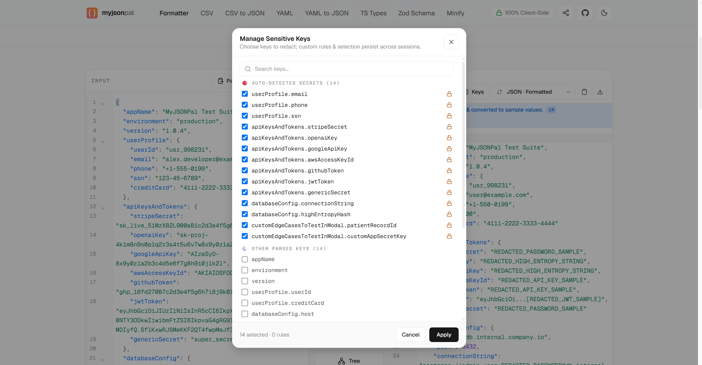

# MyJSONPal

**A privacy-first, in-browser JSON and data studio for developers.**

MyJSONPal helps you format, validate, repair, inspect, transform, and sanitize structured data without sending your payloads to a processing server.

**Live app:** [myjsonpal.com](https://myjsonpal.com)



## What it provides

MyJSONPal brings common JSON and data tasks into one focused workspace:

- **Format and validate JSON** with syntax highlighting, inline errors, and a collapsible tree view.
- **Repair common JSON mistakes** such as trailing commas, single quotes, unquoted keys, comments, and Python-style literals.
- **Minify JSON** to remove unnecessary whitespace and reduce payload size.
- **Convert JSON to CSV** for spreadsheets and tabular workflows.
- **Convert CSV to JSON** with support for headers, quoted fields, commas, and multiline values.
- **Convert JSON to YAML** for configuration files and deployment workflows.
- **Convert YAML to JSON** for APIs, scripts, and tools that require strict JSON.
- **Generate TypeScript interfaces** from representative JSON data.
- **Generate Zod schemas** with inferred TypeScript types.
- **Sanitize secrets and PII** by detecting and replacing API keys, tokens, passwords, connection strings, emails, phone numbers, and other sensitive values.

## Why MyJSONPal

### Privacy by design

Data processing happens in the browser, with Web Workers used for heavier operations so the interface remains responsive. JSON, CSV, and YAML payloads are not uploaded to a conversion API or stored by the app. This makes MyJSONPal useful for private API responses, configuration files, logs, fixtures, and debugging data.

### One workspace instead of many tabs

Paste text or drop a file into the editor, choose an operation, then copy or download the result. The same workspace supports formatting, repair, conversion, tree inspection, and export.

### Built for everyday developer work

MyJSONPal is useful when you need to:

- inspect a deeply nested API response;
- fix a malformed JSON snippet quickly;
- turn data into CSV for Excel or Google Sheets;
- generate types or validation schemas from an API sample;
- prepare a safe JSON fixture before sharing it in a ticket, issue, or prompt.

## Preview

### Light and dark themes

<p>
  
  
</p>

### Explore JSON as a tree


### Generate Zod schemas



### Sanitize secrets and PII

<p>
  
  
</p>

Additional tools and features you can explore from the main myjsonpal website! 

## Tech stack

- [Astro](https://astro.build/) for the site and page structure
- [React](https://react.dev/) for interactive editor experiences
- [CodeMirror](https://codemirror.net/) for the code editors
- [Tailwind CSS](https://tailwindcss.com/) for styling
- Web Workers for non-blocking client-side processing
- [Vitest](https://vitest.dev/) for tests

## Run locally

### Requirements

- Node.js `>=22.12.0`
- npm

### Setup

```bash
npm install
npm run dev
```

The development server runs at [localhost:4321](http://localhost:4321).

### Available commands

| Command | Purpose |
| --- | --- |
| `npm run dev` | Start the local development server |
| `npm run build` | Create a production build in `dist/` |
| `npm run preview` | Preview the production build locally |
| `npm run check` | Run Astro and TypeScript checks |
| `npm test` | Run the test suite with Vitest |
| `npm run deploy` | Build and deploy to Cloudflare Pages |

## Project structure

```text
src/
├── components/   # Shared Astro and React UI components
├── config/       # Site metadata and tool definitions
├── layouts/      # Shared page layouts
├── pages/        # Tool routes and static pages
├── utils/        # JSON processing and editor helpers
└── workers/      # Background processing for larger payloads
public/           # Static assets and deployment headers
```

## Contributing

Issues, bug reports, and focused improvements are welcome. Please include a reproducible example when reporting a parsing or conversion problem, and remove real secrets or personally identifiable information before sharing sample data.

## License

No license file is currently included in this repository. Contact the project maintainer before redistributing the code.

## Links

- [MyJSONPal](https://myjsonpal.com)
- [About MyJSONPal](https://myjsonpal.com/about/)
- [Contact](https://myjsonpal.com/contact/)
